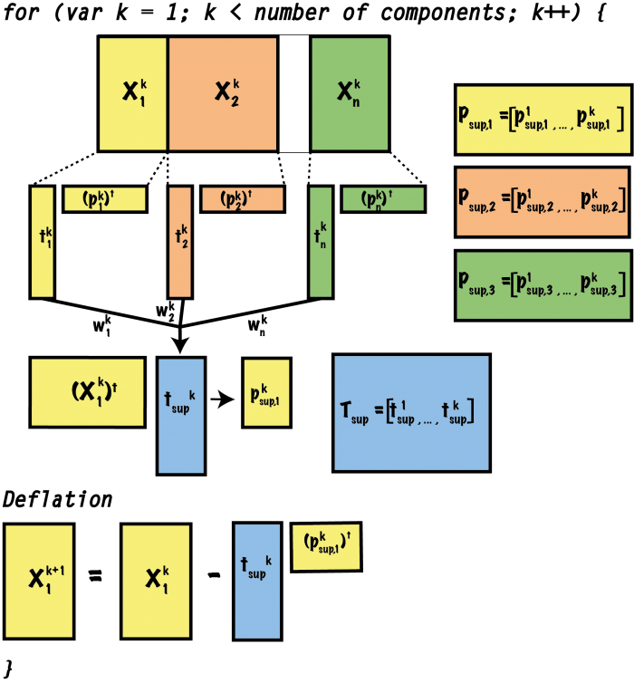

# CPCA

[![NPM version][npm-image]][npm-url]
[![build status][ci-image]][ci-url]
[![Test coverage][codecov-image]][codecov-url]
[![npm download][download-image]][download-url]
  
Consensus Principal Component Analysis

<p align="center">
  
</p>

## Installation

`$ npm istall cpca`

## [API Documentation](https://cheminfo.github.io/cpca/)

## Example

```js
import cpca from 'cpca';
```

**Arguments**

* `x`: Matrix containing the inputs.

**Options**

* `center`: boolean indicating if data should be centered (default: 'true').
* `scale`: boolean indicating if data should be scaled (default: 'false').
* `method`: It refers to the method to calculate the initial super score. This method can be 'EVD' or 'ones' (default: 'ones').
* `blocksSlicing`: This option indicates how the partition of the blocks will be done. Could be a 'number' in the case of data blocks with equal number of blocks or 'Array' in the case of data blocks with different number of columns. In the 'Array' case each element of the array indicates one block and the number indicates the number of columns in the corresponding block (default: number of variables in the data set).
* `componentsNumber`: This option indicates the number of components that will work with (default: number of variables in the data set).

## License

[MIT](./LICENSE)

[npm-image]: https://img.shields.io/npm/v/cpca.svg
[npm-url]: https://www.npmjs.com/package/cpca
[ci-image]: https://github.com/josoriom/cpca/workflows/Node.js%20CI/badge.svg?branch=master
[ci-url]: https://github.com/josoriom/cpca/actions?query=workflow%3A%22Node.js+CI%22
[codecov-image]: https://img.shields.io/codecov/c/github/josoriom/cpca.svg
[codecov-url]: https://codecov.io/gh/josoriom/cpca
[download-image]: https://img.shields.io/npm/dm/cpca.svg?style=flat-square
[download-url]: https://www.npmjs.com/package/cpca

## References

[1] Westerhuis, J. A., Kourti, T., & MacGregor, J. F. (1998). Analysis of multiblock and hierarchical PCA and PLS models. Journal of Chemometrics: A Journal of the Chemometrics Society, 12(5), 301-321. DOI: https://doi.org/10.1002/(SICI)1099-128X(199809/10)12:5<301::AID-CEM515>3.0.CO;2-S

[2] Smilde, A. K., Westerhuis, J. A., & de Jong, S. (2003). A framework for sequential multiblock component methods. Journal of Chemometrics: A Journal of the Chemometrics Society, 17(6), 323-337. DOI: https://doi.org/10.1002/cem.811

[3] Xu, Y., & Goodacre, R. (2012). Multiblock principal component analysis: an efficient tool for analyzing metabolomics data which contain two influential factors. Metabolomics, 8(1), 37-51. DOI: https://doi.org/10.1007/s11306-011-0361-9
